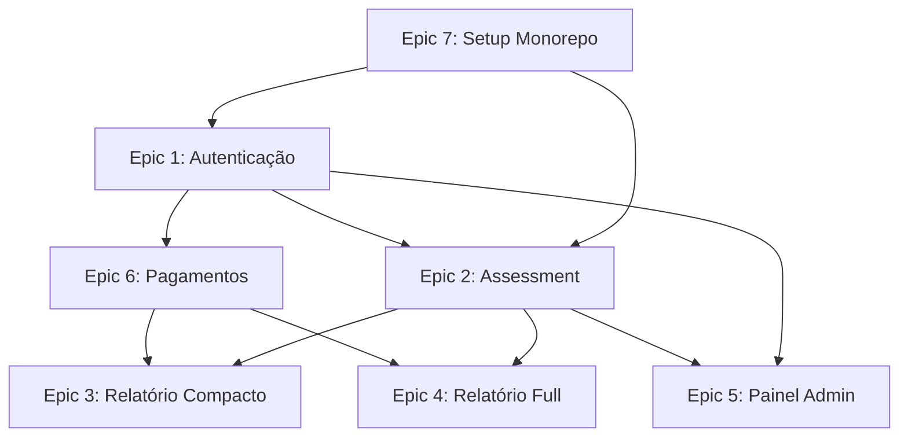

# Épicos - Sistema V2 "Jornada do Empreendedor"

**Product Owner:** @pm (Morgan)
**Data de Criação:** 2026-03-15
**Baseado em:** PRD v2.1.0 + Arquitetura v1.0.0

---

## Índice de Épicos

| ID | Título | Prioridade | Estimativa | Status | Dependências |
|----|--------|-----------|-----------|--------|--------------|
| [EPIC-001](./epic-01-autenticacao-jwt-rls.md) | Autenticação JWT + RLS | 🔴 P0 | Large (8-10d) | 📋 Backlog | Epic 7 |
| [EPIC-002](./epic-02-assessment-103-perguntas.md) | Assessment 103 Perguntas | 🔴 P0 | Large (10-12d) | 📋 Backlog | Epic 1, 7 |
| [EPIC-003](./epic-03-relatorio-compacto.md) | Relatório Compacto | 🟡 P1 | Medium (6-8d) | 📋 Backlog | Epic 2, 6 |
| [EPIC-004](./epic-04-relatorio-full.md) | Relatório Full | 🟡 P1 | Medium (7-9d) | 📋 Backlog | Epic 2, 6 |
| [EPIC-005](./epic-05-painel-admin.md) | Painel Admin | 🟡 P1 | Medium (6-8d) | 📋 Backlog | Epic 1, 2 |
| [EPIC-006](./epic-06-pagamentos-stripe.md) | Pagamentos Stripe | 🔴 P0 | Medium (5-7d) | 📋 Backlog | Epic 1 |
| [EPIC-007](./epic-07-setup-monorepo-cicd.md) | Setup Monorepo + CI/CD | 🔴 P0 | Medium (4-6d) | 📋 Backlog | - |

**Total Estimado:** 46-60 dias (com 2 devs em paralelo: ~30-40 dias corridos)

---

## Roadmap Visual

### Sprint 0: Infraestrutura (Semana 1)
```
Epic 7: Setup Monorepo + CI/CD
├── US-007.1: Turborepo init
├── US-007.2: GitHub Actions CI
└── US-007.3: Deploy automatizado
```

### Sprint 1: Autenticação (Semana 2)
```
Epic 1: Autenticação JWT + RLS
├── US-001.2: Login (3d) ⭐ MVP Core
├── US-001.1: Registro (2d)
├── US-001.3: Refresh Token (1d)
├── US-001.4: Reset Senha (1d)
└── US-001.5/6: Admin + RLS (1d)
```

### Sprint 2-3: Assessment (Semanas 3-4)
```
Epic 2: Assessment 103 Perguntas
├── US-002.1: Iniciar Assessment (1d)
├── US-002.2: Responder + Auto-Save (4d) ⭐ MVP Core
├── US-002.3: Navegação (2d)
├── US-002.6: Cálculo de Scores (3d) ⭐ MVP Core
├── US-002.4: Preview (1d)
└── US-002.5: Finalizar (1d)
```

### Sprint 4: Pagamentos + Relatório Compacto (Semana 5-6)
```
Epic 6: Pagamentos Stripe
├── US-006.1: Checkout Compacto (2d)
├── US-006.2: Webhooks (2d)
└── US-006.3: Frontend (1d)

Epic 3: Relatório Compacto
├── US-003.1: Geração PDF (4d) ⭐ MVP Core
└── US-003.2: Download (2d)
```

### Sprint 5: Relatório Full + Painel Admin (Semana 7-8)
```
Epic 4: Relatório Full
├── US-004.1: Interface de Edição (4d)
└── US-004.2: Geração PDF Full (3d)

Epic 5: Painel Admin
├── US-005.1: Lista de Participantes (3d)
└── US-005.2: Gráficos Inline (3d)
```

---

## MVP Core (Mínimo Viável para Launch)

**Épicos essenciais:**

1. ✅ **Epic 7:** Setup Monorepo + CI/CD
2. ✅ **Epic 1:** Autenticação (Login + Registro)
3. ✅ **Epic 2:** Assessment 103 Perguntas + Cálculo de Scores
4. ✅ **Epic 6:** Pagamentos Stripe (Compacto)
5. ✅ **Epic 3:** Relatório Compacto

**Épicos pós-MVP (v1.1):**

6. ⚠️ **Epic 4:** Relatório Full (pode ser manual inicialmente)
7. ⚠️ **Epic 5:** Painel Admin (admin usa Supabase Dashboard)

---

## Critérios de Aceitação do Roadmap

### MVP Launch (30 dias, 2 devs)

- [x] **Epic 7 completo** - CI/CD funcionando
- [ ] **Epic 1 completo** - Login + Registro + JWT
- [ ] **Epic 2 completo** - Assessment 103 perguntas + Scores
- [ ] **Epic 6 completo** - Pagamento Stripe (Compacto)
- [ ] **Epic 3 completo** - Relatório Compacto automatizado
- [ ] **Test Coverage:** > 80%
- [ ] **Sentry ativo:** Capturando erros (já implementado na Fase 1)
- [ ] **Performance:** Login < 500ms, Cálculo Scores < 5s, Geração PDF < 30s

### v1.1 (15 dias adicionais)

- [ ] **Epic 4 completo** - Relatório Full
- [ ] **Epic 5 completo** - Painel Admin

---

## Dependências Entre Épicos



**Legenda:**
- 🔴 P0 = Crítico (bloqueante)
- 🟡 P1 = Alta (importante)
- 🟢 P2 = Média (nice to have)

---

## Próximos Passos

1. **@sm (River):** Criar stories granulares para cada épico (começar por Epic 7 → 1 → 2 → 6 → 3)
2. **@devops (Gage):** Executar Epic 7 (Setup Monorepo + CI/CD)
3. **@dev (Dex):** Aguardar stories do Epic 1 para iniciar desenvolvimento

---

## Handoff para @sm

**Priorização de criação de stories:**

1. **Epic 7** - Setup (bloqueante, começar agora)
2. **Epic 1** - Autenticação (bloqueante, paralelo com Epic 7)
3. **Epic 2** - Assessment (core do produto)
4. **Epic 6** - Pagamentos (monetização)
5. **Epic 3** - Relatório Compacto (entrega de valor)
6. **Epic 4** - Relatório Full (produto premium)
7. **Epic 5** - Painel Admin (gestão)

**Formato:** Stories de 1-3 dias cada, seguindo template AIOS com AC detalhados.

---

**Criado por:** @pm (Morgan)
**Data:** 2026-03-15
**Versão:** 1.0.0

— Morgan, planejando o futuro 📊
